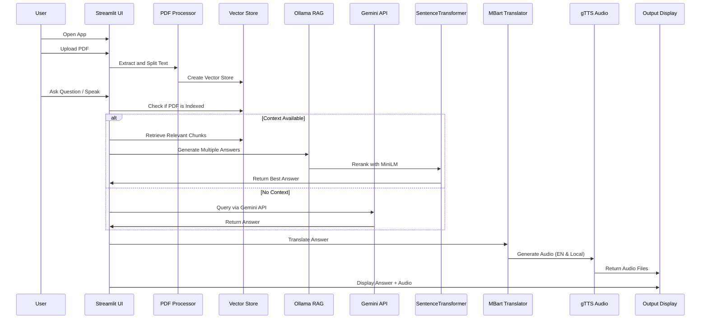
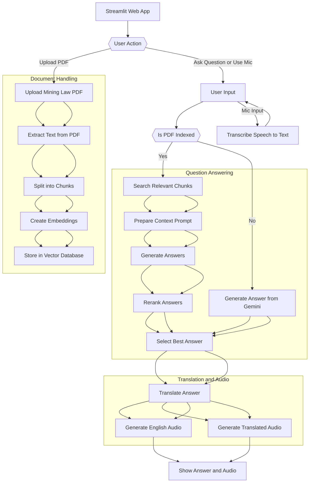

<h1 align="center">
  🤖 MinerlexAI 3.0  
</h1>
<p align="center">
  <em>Revolutionizing Mining Law with AI-Powered Precision</em><br>
  🏛️ 🇮🇳 Multilingual Legal Assistant | 📚 RAG + Reranking | 🎙️ Voice + Translation | 💡 Gemini + Ollama + FAISS
</p>

<p align="center">
  
  
  
</p>

---

## 🧠 What is MinerlexAI?

**MinerlexAI 3.0** is your intelligent legal research assistant tailored for Indian mining laws. It reads your PDFs, understands your questions, and delivers clear answers in your chosen Indian language—with voice support.

> 🧾 Ideal for **legal researchers**, **activists**, **tribal communities**, **government officers**, and **NGOs** working in the mining and legal ecosystem.

---

## ✨ Key Features

🔍 **Document Understanding**  
‣ Upload mining law PDFs and auto-index with semantic chunking  
‣ Uses `PDFPlumber + FAISS` for RAG-based retrieval

🧠 **Smart AI Answers**  
‣ Uses Gemini + DeepSeek for precise legal Q&A  
‣ 3x candidate generation + semantic reranking using `MiniLM-L6-v2`

🌐 **Multilingual & Inclusive**  
‣ Translate answers into 12+ Indian languages via `MBart50`  
‣ Supports English, Hindi, Bengali, Tamil, Telugu, Marathi, and more

🔊 **Text-to-Speech**  
‣ Converts both English & regional text answers to voice  
‣ Empowers low-literacy communities with spoken legal access

🎙️ **Speech Input**  
‣ Speak your question instead of typing  
‣ Uses `SpeechRecognition` and Google ASR

---

## 🖼️ UI Preview

<p align="center">
  
</p>

---

## ⚙️ Tech Stack

| Area               | Tools & Models                          |
|--------------------|-----------------------------------------|
| Frontend UI        | Streamlit (custom dark theme)           |
| LLMs               | Gemini 1.5 Flash, DeepSeek via Ollama   |
| RAG                | LangChain + FAISS + PDFPlumber          |
| Translation        | MBart50 Many-to-Many (HuggingFace)      |
| Embeddings         | Ollama (DeepSeek R1)                    |
| Answer Reranking   | SentenceTransformers (`MiniLM-L6-v2`)   |
| Voice Synthesis    | gTTS (Google Text-to-Speech)            |
| Speech Input       | SpeechRecognition + Google API          |

---

## 📁 Folder Structure

```

minerlexai/
├── main.py                # Streamlit app
├── .env                   # Your API key for Gemini
├── requirements.txt       # All Python dependencies
└── README.md              # You're reading it!

````

---

## 🔧 Getting Started

1️⃣ Clone the repository  
```bash
git clone https://github.com/yourusername/minerlexai.git
cd minerlexai
````

2️⃣ Create a virtual environment

```bash
python -m venv venv
source venv/bin/activate   # Windows: venv\Scripts\activate
```

3️⃣ Install dependencies

```bash
pip install -r requirements.txt
```

4️⃣ Add your Gemini API key to `.env`

```
GEMINI_API_KEY=your_api_key_here
```

5️⃣ Login to Hugging Face

```bash
huggingface-cli login
```

6️⃣ Run the app

```bash
streamlit run main.py
```

---

## 🌍 Supported Languages

| Language           | Translation ✅ | Audio 🔊 |
| ------------------ | ------------- | -------- |
| English            | ✅             | ✅        |
| Hindi (हिन्दी)     | ✅             | ✅        |
| Bengali (বাংলা)    | ✅             | ✅        |
| Tamil (தமிழ்)      | ✅             | ✅        |
| Telugu (తెలుగు)    | ✅             | ✅        |
| Marathi (मराठी)    | ✅             | ✅        |
| Gujarati (ગુજરાતી) | ✅             | ✅        |
| Malayalam (മലയാളം) | ✅             | ✅        |
| Kannada (ಕನ್ನಡ)    | ✅             | ✅        |
| Urdu (اردو)        | ✅             | ✅        |
| Odia (ଓଡ଼ିଆ)       | ✅             | ❌        |
| Assamese (অসমীয়া) | ✅             | ❌        |


---

### 🎨 **MinerlexAI 3.0 Sequence Diagram**


---
### 🎨 **MinerlexAI 3.0 Flowchart Diagram**

---
### 🔍 Key Components in Flow:

| Component                        | Role                                                 |
| -------------------------------- | ---------------------------------------------------- |
| `Streamlit`                      | Frontend for UI and interaction                      |
| `PDFPlumber`                     | Extracts text from PDF                               |
| `RecursiveCharacterTextSplitter` | Splits text into semantically meaningful chunks      |
| `FAISS`                          | Stores and retrieves embeddings                      |
| `Ollama + DeepSeek`              | Generates context-aware answers                      |
| `SentenceTransformers`           | Reranks answers semantically                         |
| `Gemini`                         | Fallback LLM when no document is uploaded            |
| `MBart50`                        | Translates output into user-selected Indian language |
| `gTTS`                           | Converts translated or original answer into speech   |
| `SpeechRecognition`              | Captures and transcribes user's spoken query         |

---

### 🧠 How the RAG + Reranking Works:

1. **Retrieve:**
   Use FAISS to fetch top-k relevant chunks from PDF based on query.

2. **Generate:**
   Pass each to the Ollama-powered RAG prompt template.

3. **Rerank:**
   Compare similarity of each generated answer to the original query using cosine similarity → choose the highest.

---


## 🎯 Use Cases

* ⚖️ Legal research and interpretation
* 🧑🏽‍🌾 Grassroots education and tribal rights
* 🏛️ Policy making and compliance for mining law
* 🧩 NGO support for land & environment advocacy
* 🗣️ Inclusive access to law via voice

---

## 📌 What's Next?

* [x] Multilingual support + TTS
* [x] RAG + Answer reranking
* [ ] Web deployment (Streamlit Cloud / Vercel)
* [ ] Fine-tuning on Indian legal data
* [ ] Visual QA from scanned government docs
* [ ] Build-in chatbot & memory

---

## 📜 License

This project is licensed under the [MIT License](LICENSE).

---

## 🧠 Acknowledgements

* [Google Gemini](https://ai.google.dev/)
* [Ollama](https://ollama.com/)
* [Hugging Face Transformers](https://huggingface.co/)
* [LangChain](https://www.langchain.com/)
* [Streamlit](https://streamlit.io/)

---


<p align="center">
  <strong>🤖 MinerlexAI</strong><br>
  <em>Built with 🇮🇳 vision, powered by AI, for a future that's smarter, fairer, and just.</em>
</p>


